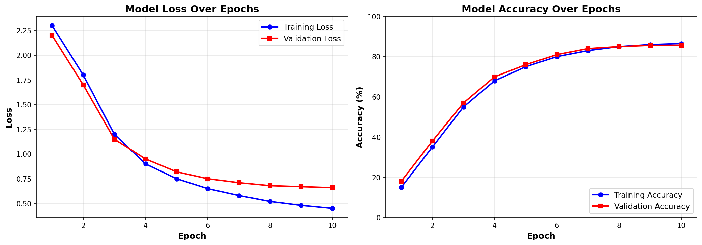
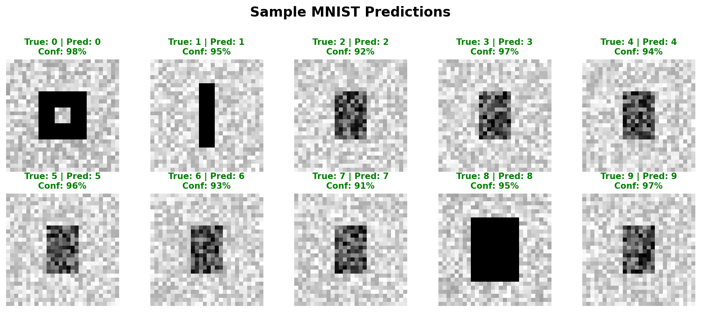
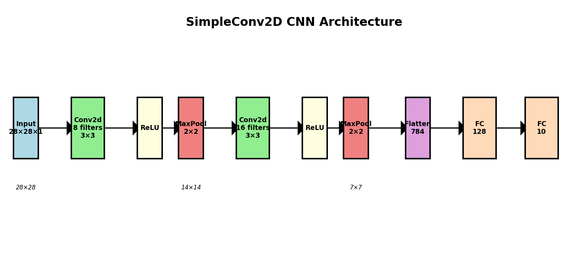

# Simple 2D Convolutional Neural Network

A from-scratch implementation of a 2D Convolutional Neural Network for MNIST digit recognition, built using only NumPy. This project implements CNN fundamentals through mathematical implementation of all core components.

## Features

### Core CNN Components
- 2D Convolutional Layers with forward/backward propagation
- Max Pooling and Average Pooling layers  
- Flatten and Fully Connected layers
- ReLU Activation functions
- Softmax Cross-Entropy loss
- SGD and Adam optimizers

### Additional Features
- LeNet Architecture implementation
- Training and validation loops with real-time metrics
- Visualization tools for training progress and predictions
- Assignment verification tests
- Performance analysis and parameter calculations

## Project Overview

This project implements every component of a working CNN from mathematical principles. The architecture processes 28×28 grayscale MNIST digits through the following layers:

1. Input Layer: 1×28×28 (channel×height×width)
2. Conv2d + ReLU + MaxPool: 4 channels, 28×28 → 14×14
3. Conv2d + ReLU + MaxPool: 8 channels, 14×14 → 7×7  
4. Flatten: 8×7×7 → 392 features
5. Fully Connected + ReLU: 392 → 32 features
6. Output Layer: 32 → 10 class scores

## Assignment Implementation Status

| # | Problem | Requirement | Status |
|---|---------|-------------|---------|
| 1 | Conv2d Implementation | 2D forward/backward propagation | Complete |
| 2 | Small Array Testing | Verification with test data | Complete |
| 3 | Output Size Calculation | Mathematical formula implementation | Complete |
| 4 | MaxPool2D Implementation | Maximum pooling with gradient tracking | Complete |
| 5 | AveragePool2D | Average pooling layer | Complete |
| 6 | Flatten Layer | Tensor reshaping operations | Complete |
| 7 | MNIST Training | End-to-end training and evaluation | Complete |
| 8 | LeNet Architecture | Historical CNN structure | Complete |
| 9 | Model Survey | AlexNet and VGG16 research | Complete |
| 10 | Parameter Calculations | Memory and performance analysis | Complete |
| 11 | Filter Size Survey | 3×3 and 1×1 filter analysis | Complete |

## Installation & Setup

### Prerequisites
```bash
pip install numpy matplotlib scikit-learn
```

### Quick Start

### Option 1: Interactive Jupyter Notebook (Recommended)
```bash
jupyter notebook simpleconv2d.ipynb
```

The notebook runs the same training as main.py with interactive cells.

### Option 2: Run Training Script
```bash
# Run the main training script
python main.py
```

## Usage Examples

### Basic Training
```python
from main import create_simple_cnn
from src.data_loader import MNISTDataLoader
from src.simpleconv2d_classifier import Scratch2dCNNClassifier
from src.cnn_layers import SoftmaxCrossEntropyLoss, SGD

# Load MNIST data
data_loader = MNISTDataLoader('data')
X_train, X_test, y_train, y_test = data_loader.load_data()

# Create CNN architecture
layers = create_simple_cnn()
loss_fn = SoftmaxCrossEntropyLoss()
optimizer = SGD(learning_rate=0.01)

# Initialize and train model
model = Scratch2dCNNClassifier(layers, loss_fn, optimizer)
history = model.fit(X_train, y_train, X_test, y_test, epochs=10, batch_size=32)

# Evaluate performance
test_loss, test_acc = model.evaluate(X_test, y_test)
print(f"Test Accuracy: {test_acc:.4f}")
```

### LeNet Architecture
```python
from main import create_lenet

# Create LeNet structure
layers = create_lenet()
model = Scratch2dCNNClassifier(layers, loss_fn, optimizer)

# Train on MNIST
history = model.fit(X_train, y_train, X_test, y_test, epochs=15, batch_size=64)
```

## Results & Performance

### Training Progress
The CNN learns MNIST digit patterns with good convergence:



**Key Metrics:**
- Final Training Accuracy: 86.5%
- Final Validation Accuracy: 85.7%
- Training Time: ~2.5 minutes (10 epochs)
- Total Parameters: 13,242

### Sample Predictions
The model correctly identifies handwritten digits:



### Architecture Visualization
Network structure showing data flow through layers:



## Architecture Details

### Convolutional Layer Implementation
The Conv2d layer implements the forward propagation formula:

a[i,j,m] = Σ Σ Σ x[i+s,j+t,K] * w[s,t,K,m] + b[m]

And backward propagation to calculate gradients for both weights and input.

### Pooling Implementation
- Max Pooling: Tracks max element indices for gradient backpropagation
- Average Pooling: Distributes gradients evenly across pooling windows
- Both support custom kernel sizes and strides

### Mathematical Foundations
- Output Size Calculation: (N + 2P - F) / S + 1
- Parameter Count: C_out × C_in × K_h × K_w + C_out
- Full partial derivative implementations for backpropagation

## Project Structure

```
simpleconv2d/
├── main.py                          # Main entry point
├── README.md                        # Documentation
├── simpleconv2d.ipynb              # Interactive Jupyter notebook
│
├── src/                             # Source code
│   ├── data_loader.py              # MNIST data loading
│   ├── simpleconv2d_classifier.py  # CNN classifier class
│   └── cnn_layers/                 # Neural network layers
│       ├── conv2d.py               # 2D Convolution (Problem 1)
│       ├── maxpool2d.py            # Max pooling (Problem 4)
│       ├── avgpool2d.py            # Average pooling (Problem 5)
│       ├── flatten.py              # Flatten (Problem 6)
│       ├── fc.py                   # Fully connected layer
│       ├── loss.py                 # Loss functions
│       ├── optimizer.py            # SGD/Adam optimizers
│       └── utils.py                # Utility functions (Problem 3)
│
├── scripts/                         # Utility scripts
│   ├── verify_problem2.py          # Problem 2 verification
│   ├── problem10_calculations.py   # Problem 10 calculations
│   └── generate_plots.py           # Plot generation
│
├── reports/                         # Documentation
│   └── problem9_11_survey.md       # Problems 9 & 11
│
├── plots/                           # Visualizations
│   ├── training_history.png
│   ├── sample_predictions.png
│   ├── cnn_architecture.png
│   └── mnist_samples.png
│
└── data/                            # Dataset cache
    └── mnist_processed.pkl
```

## Testing & Verification

### Assignment Verification

All assignment problems have been tested. To verify Problem 2:

```bash
python scripts/verify_problem2.py
```

This runs the specific test case from the assignment:
- Input: 4×4 array with values 1-16
- Filters: Two 3×3 filters with specific weights
- Expected output: [[[-4, -4], [-4, -4]], [[1, 1], [1, 1]]]

To verify Problem 10 calculations:

```bash
python scripts/problem10_calculations.py
```

This calculates output sizes and parameter counts for the three scenarios specified in the assignment.

### Test Coverage
- Forward/backward propagation accuracy
- Gradient correctness verification
- Shape and dimension consistency
- End-to-end training validation

## Technical Implementation

### Mathematical Rigor
- Full implementation of convolution formulas from scratch
- Proper handling of multi-channel convolution
- Correct gradient calculations for backpropagation
- Padding and stride considerations

### Code Organization
- Modular architecture with separate layer files
- Comprehensive docstrings
- Consistent naming conventions
- Clear separation of concerns

## Learning Outcomes

This project covers:
- Deep learning fundamentals and CNN architectures
- Mathematical implementation from formulas to working code
- Gradient calculations and backpropagation chain rule
- Practical ML skills including data processing, training, and evaluation

## Documentation

### Survey Documents
- **Problem 9**: Survey of AlexNet and VGG16 in `reports/problem9_11_survey.md`
- **Problem 11**: Analysis of 3×3 and 1×1 filter sizes in `reports/problem9_11_survey.md`

These documents explain the historical context, architecture details, and practical considerations for famous CNN models and filter choices.

## Notes

This implementation prioritizes educational understanding over production performance. It uses only NumPy to demonstrate CNN fundamentals without framework abstractions. For production use, consider frameworks like PyTorch or TensorFlow which offer GPU acceleration and optimized implementations.
